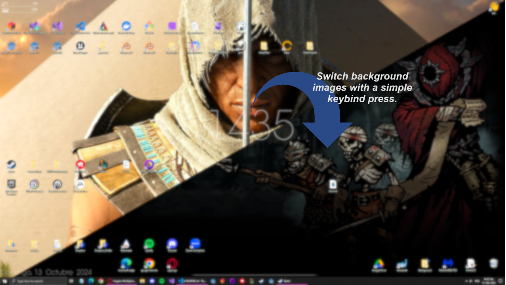
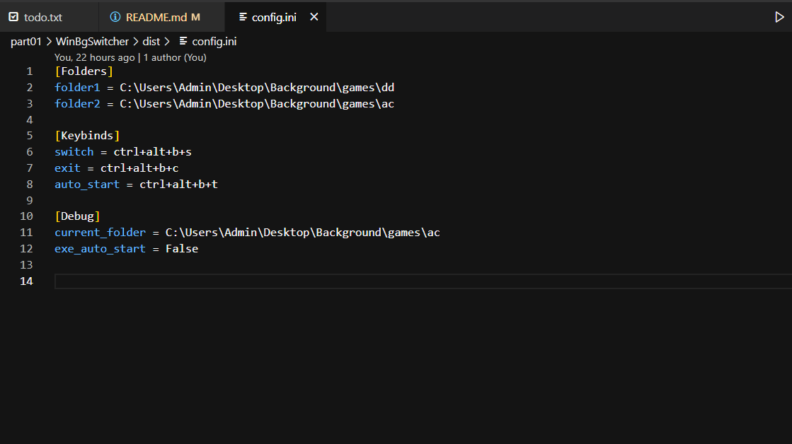

# WinBgSwitcher

A Windows desktop background switcher built with Python.

For further instructions, look below.

## Overview

The WindowsBackgroundSwitcher is a small program I designed in a few hours time to run in the background of my PC.
It allows for users to switch the desktop background image with the press of a keybind.
It uses two folders to swap between images and can run on startup for ease of use.

---

The WinBgSwitcher has various aspects of how and why you might want to use it.

- I designed it to quickly swap my desktop images for ones I don’t mind sharing during screen shares on Discord, Zoom, or some other tools for my studies.
- You can also use it as a manual desktop slideshow, changing your background with a keybind whenever you want to switch things up.
- Annoyed by bright desktop images at night? Easily switch between folders of bright and dark images.
- You might find even more uses for it. Feel free!

The executable works with a config.ini file, which allows you to set the two folders and customize the keybinds to your liking.
Just make sure they **don’t conflict with any other keybinds** from other software you use.

`folder1 = C:\Users\Admin\Desktop\Background\games\dd`

`folder2 = C:\Users\Admin\Desktop\Background\games\ac`



## Installation and Setup

### Installation

1. Download the project (Code -> Download as zip).
2. Unzip the project in your Downloads folder.
3. Locate and open the `dist` folder (inside are the files you need).
4. You can now move the `win_bg_switcher.exe` and `config.ini` files to whatever folder you want.

```txt
some\
    folder\
          path\
              config.ini
              win_bg_switcher.exe
```

_Before you continue, delete the leftover files from your Downloads folder!_

1. **Before you execute the programm** open the config.ini and change the folder paths under `Folders` and the keybinds under `Keybinds` to your needs.
2. Run the executable manually. If you want the programm to start automatically with your windows pc you can now press the `auto_start` keybind.

### How to use (after the executable is running)



- To **change your config.ini settings**, you'll need to exit and relaunch the program for the changes to take effect.

---

- If you want to **close the program**, press the **exit** keybind.
- Pressing the **switch** keybind will choose a random image from either folder 1 or 2, based on the last folder used. For example, if the last image was from folder 2, the next switch will pull from folder 1.
  - _If you only have one image in each folder, it will simply switch between those two images back and forth._

---

- To **add the executable to the startup menu** (so it runs automatically when your PC starts), press the auto-start keybind.
- If it's **already in the startup menu**, pressing the keybind will remove it.
  - For more information on whether the executable is in the startup menu, check the config.ini file under the debug option: `exe_auto_start = True / False`. Alternatively, you can confirm through Task Manager or by looking for a link in `C:\Users\Admin\AppData\Roaming\Microsoft\Windows\Start Menu\Programs\Startup`.

If you have **further questions** or problems running the program, open the discussion tab on GitHub and leave a comment.

### Compile the executable yourself

The entire project is licensed under the MIT License. If you want, you can go ahead and compile the executable yourself. Just download or clone the project, ensure you have Python and all the required packages installed on your PC, and then compile it. I used the command `pyinstaller --onefile --windowed --icon=icon.ico win_bg_switcher.py`.

## Bibliography

[My Portfolio](https://cuppixx.github.io)

[RidiculousCodingCuppixxVersion](https://github.com/Cuppixx/RidiculousCodingCuppixxVersion/tree/main)

[KoalaTime_Take_A_Break](https://github.com/Cuppixx/KoalaTime_Take-A-Break)

[PandaTime_Take_A_Break](https://github.com/Cuppixx/PandaTime_Take-A-Break)

[TravelingSalesmanProblem_ClassProject](https://github.com/Cuppixx/TravelingSalesmanProblem_ClassProject)

[WinBgSwitcher](https://github.com/Cuppixx/WinBgSwitcher)

[sequential_renamer.bat](https://gist.github.com/Cuppixx/5c4b4bca0cdd31ba457480c27727e7db)

More fun links to come ....

### Reference and Template Sources

| Authors    | Resources   |
| ---------- | ----------- |
| None       | None        |
